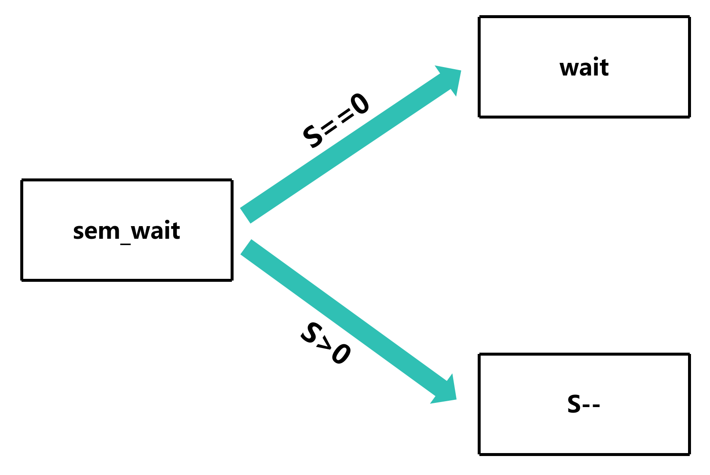
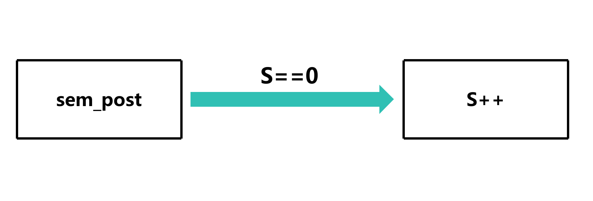
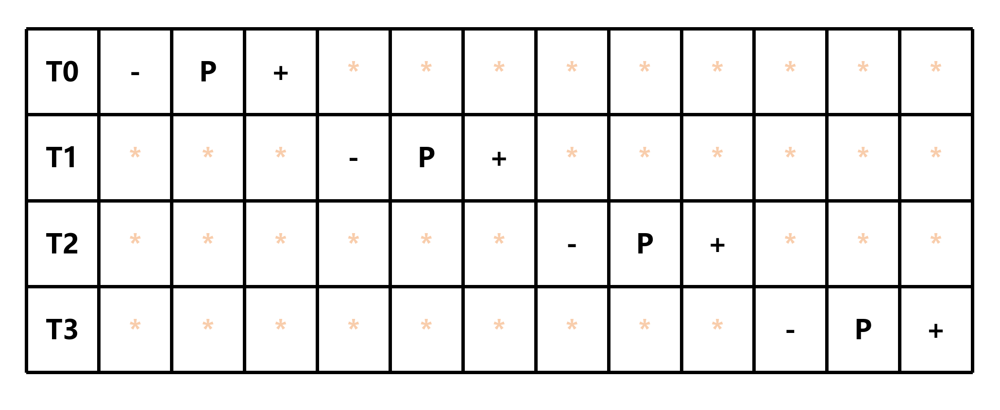

# 信号量

信号量 (Semaphore) 是一种用于控制对共享资源的访问的同步原语

它可以用于限制同时访问共享资源的线程或进程的数量，从而避免竞争条件

## 语法

### C++20 标准信号量

需要引入 `semaphore` 头文件

```cpp
#include <semaphore>
```

一共有两种信号量

- 计数信号量: 以最大值为限制，只能有最大值个线程同时访问共享资源和执行代码块
- 二值信号量: 等价于最大值和初始值都为1的计数信号量，只能有一个线程同时访问共享资源和执行代码块
    - 把初始值设置成大于1的值属于**未定义行为**

```cpp
// 计数信号量，模板参数为最大值
std::counting_semaphore<最大值> semaphore(初始值);

// 二值信号量 (等价于初始值为1的计数信号量)
std::binary_semaphore semaphore(1);
```

## 示例

假设现在有4个线程

```cpp
std::thread threads[4];
```

每个线程执行的任务如下

```cpp
void task(int id)
{
    std::this_thread::sleep_for(std::chrono::seconds(1)); // 休眠1秒，模拟任务执行时间
    std::cout << "Hello from thread " << id << "\n";
}
```

```cpp
for (int i = 0; i < 4; i++)
{
    threads[i] = std::thread(task, i);
}

for (int i = 0; i < 4; i++)
{
    threads[i].join();
}
```

但现在有个刁钻的需求，希望每两个线程同时执行代码块

虽说可以使用条件判断在偶数时暂停创建线程

```cpp
for (int i = 0; i < 4; i++)
{
    if (i % 2 == 0 && i != 0)
    {
        std::this_thread::sleep_for(std::chrono::seconds(1)); // 暂停1秒，先让前两个线程执行代码块
    }
    threads[i] = std::thread(task, i);
}

for (int i = 0; i < 4; i++)
{
    threads[i].join();
}
```

但是这样并不优雅且效率低，那有什么更好的方法吗？

### 使用计数信号量

我们可以使用计数信号量来实现每两个线程同时执行代码块的需求

```cpp
static std::counting_semaphore<2> semaphore(2);
```

- 由于我们希望每两个线程同时执行代码块，所以信号量的初始值和最大值都为2

然后在线程代码块中添加如下代码来获取信号量和释放信号量

```cpp
void task(int id)
{
    semaphore.acquire();
    std::this_thread::sleep_for(std::chrono::seconds(1)); // 休眠1秒，模拟任务执行时间
    std::cout << "Hello from thread " << id << "\n";
    semaphore.release();
}
```

那么现在可以抛弃那个奇怪的条件判断，直接创建4个线程

```cpp
for (int i = 0; i < 4; i++)
{
    threads[i] = std::thread(task, i);
}

for (int i = 0; i < 4; i++)
{
    threads[i].join();
}
```


### 示意图

- S: 信号量的值

#### acquire

acquire 相当于 (`sem_wait`) 如果信号量的值大于0，就获取信号量并减1，否则阻塞等待直到信号量的值大于0



#### release

release 相当于 (`sem_post`) 当信号量的值小于最大值，就释放信号量并加1



#### 运行过程


